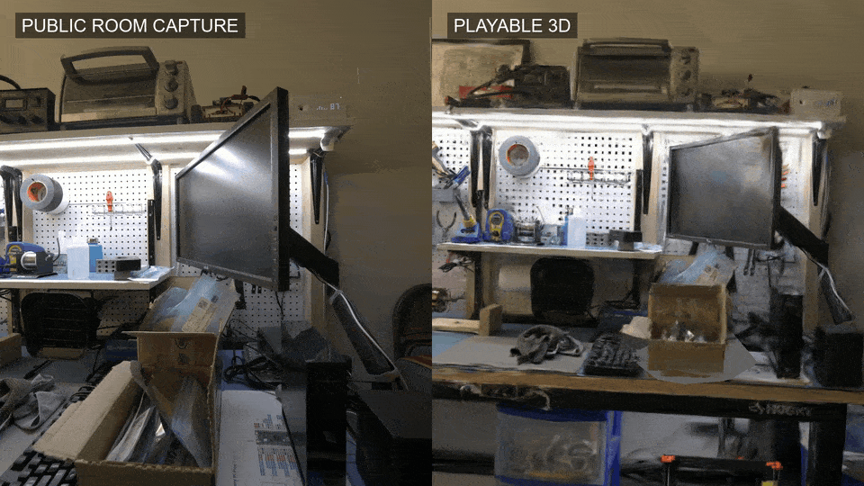
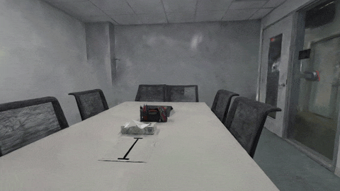
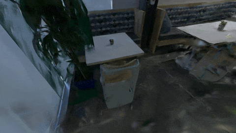
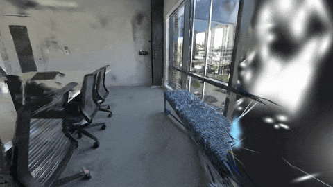
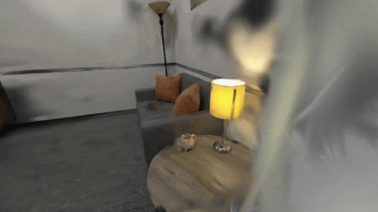
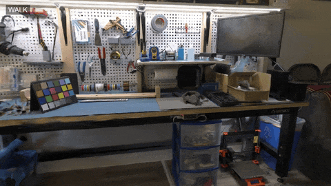
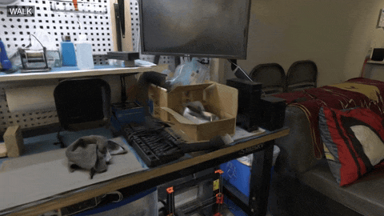
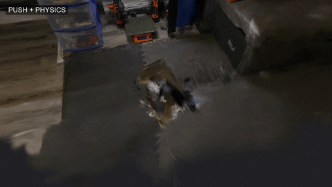

[](https://rsasaki0109.github.io/movie2threejs/demos/workbench/)

**Real room capture → a walkable, physical three.js world.**

**[Play the five live demos →](https://rsasaki0109.github.io/movie2threejs/)**

<table>
<tr><th>Meeting room · calibrated capture</th><th>Kitchen & cafe · knock a chair over</th></tr>
<tr>
<td><a href="https://rsasaki0109.github.io/movie2threejs/demos/meeting-room/"></a></td>
<td><a href="https://rsasaki0109.github.io/movie2threejs/demos/cafe/"></a></td>
</tr>
<tr><th>Window office · move a cushion</th><th>Furnished room · send a cushion flying</th></tr>
<tr>
<td><a href="https://rsasaki0109.github.io/movie2threejs/demos/lounge/"></a></td>
<td><a href="https://rsasaki0109.github.io/movie2threejs/demos/furnished-room/"></a></td>
</tr>
</table>

**Five real captures, five playable demos.** [Live gallery](https://rsasaki0109.github.io/movie2threejs/) · [Run locally](docs/live-demo.md) · [Measured runs](docs/benchmarks.md#additional-gallery-captures) · [Data & license](docs/data-attribution.md). These use public capture-rig photographs.

The workbench and meeting room use **provided camera calibration and sparse points** for clearer showcases (156 and 192 photographs respectively). VGGT was not used for those two examples. The other three rooms use estimated VGGT poses. [Quality comparison and remaining artifacts](docs/quality.md).

<table>
<tr><th>Explore</th><th>Push</th><th>Throw</th></tr>
<tr>
<td></td>
<td></td>
<td></td>
</tr>
</table>

Explore, push and throw excerpts above are three interactions in the same apartment workbench.

[](https://colab.research.google.com/github/rsasaki0109/movie2threejs/blob/master/notebooks/playworld_colab.ipynb)
Open the notebook, then upload a project ZIP prepared with `python scripts/package_colab.py --sources-only` from a clone of this repository. [Measured Colab run and remaining UI checks](docs/colab-ui.md).

Try the verified synthetic room in three commands:

```bash
pip install "playworld @ git+https://github.com/rsasaki0109/movie2threejs.git"
playworld demo --out demo_world
python -m http.server -d demo_world 8000
```

Open http://localhost:8000. **WASD** walk · **Space** jump · **Click** throw · **E** push · **R** reset · **C** colliders.

# playworld (working name)

The hero uses a real public apartment capture from **Eyeful Tower (MIT)**, visualized from capture-rig photographs. It is not a smartphone recording or the author's room. [Source and license](docs/data-attribution.md) · [High-quality MP4](docs/hero.mp4) · [Measured GPU runs](docs/benchmarks.md).

The current workbench uses **156 calibrated public photographs**, gsplat and SAM 3 on an existing Colab L4. Browser comparison selected the **5,000-step checkpoint from a 30,000-step trial**; longer training made the selected views more speckled. Its world has **1 reviewed movable box and 2,834 static colliders**. The full training trial took **2,363.596 s**, excluding setup and other stages. Browser checks confirm walking, a ray push that drops the box from the workbench, a thrown ball, and fixed-step replay. The 13 s hero is actual viewer output with a scripted camera and physics events. The earlier video/VGGT run remains in the benchmark history.

## How it works

```
video → frames → VGGT camera poses + points
                   ├─ gsplat → Gaussian reconstruction
                   └─ SAM 3 → tracked object masks
                          ↓
                 floor, scale, rigid bodies + static colliders
                          ↓
                 three.js + Spark + Rapier → browser world
```

The world builder estimates gravity from upright camera poses, fits the lower supported floor and assumes a camera height for scale. It lifts masks onto visible Gaussians, separates movable objects, and makes each object solid down to its support. Compact background points become merged static collision boxes. Object spill is removed before export; small flat support patches and colored interior fills cover unobserved surfaces approximately. The reviewed workbench box uses only a horizontal bottom cap, keeping its top open.

## Make a real capture

The [GPU recipe](docs/gpu.md) and notebook share the same isolated VGGT, gsplat and SAM 3 environments. The original video/VGGT workbench recipe uses 24 frames, 7,000 training steps and bundle adjustment. The current calibrated showcase uses [a separate photograph recipe](docs/quality.md#calibrated-public-showcase). Stage reports preserve timings, failures, source hashes and actual GPU information. [Colab CLI instructions](docs/colab-cli.md) use an existing runtime.

For your own video, keep the phone upright, move slowly in a bright room, and capture the floor and the sides of objects. The pipeline accepts video input; a real smartphone capture has not been validated yet. Review floor height, masks and collisions before recording.

The [recording workflow](docs/recording.md) uses a JSON timeline, fixed 1/60 s physics and Playwright canvas capture. [The hero shot](shots/hero.json) records camera positions, a push and a throw; its action ray is specified independently of the cinematic camera. Interactive walking uses Rapier's capsule character controller.

The [live demo gallery](https://rsasaki0109.github.io/movie2threejs/) includes five actual captured spaces, with desktop and touch controls. The workbench is a 20.1 MB SPZ download with view-dependent color retained. [Quality comparisons](docs/quality.md) record adopted changes and rejected experiments. [Hosting and verification details](docs/live-demo.md).

## Stages

| command | output |
|---|---|
| `playworld frames VIDEO SCENE` | evenly sampled frames |
| `playworld poses SCENE --vggt-dir ...` | VGGT poses and points in COLMAP format |
| `playworld train SCENE --gsplat-dir ...` | trained Gaussians |
| `playworld segment SCENE --prompts "chair,box"` | tracked instance masks |
| `playworld world SCENE --out OUT` | world.json, split splats and viewer |
| `playworld all VIDEO SCENE --out OUT ...` | measured pipeline; per-stage Python environments |

## Known limitations

- Metric scale assumes a camera height (`--eye-height`, default 1.5 m); true scale accuracy is unmeasured. Gravity assumes an upright camera.
- Unseen surfaces lack photographic texture. Flat support patches and colored fills are simple approximations. The reviewed workbench box uses a bottom cap; other objects retain convex interior fills. Thin or open objects can still look incomplete when turned over.
- The public workbench has blur and incomplete floor/edge coverage outside the observed viewpoints. There is no general room inpainting or automatic boundary completion.
- Masks, convex colliders and masses are estimates. Review them before using a new scene; not every detected label becomes a useful movable object.
- The default VGGT weights are non-commercial. SAM 3 weights require approved Hugging Face access; model terms apply separately from the dataset's MIT license.
- SAM 3 was verified on L4. T4 compatibility is unverified; the current object recipe requires native bf16 hardware.
- The interactive Colab notebook completed the public video/VGGT recipe on L4 in **12 min 25.7 s**, including initial model downloads; environment setup took another **10 min 1.6 s**. Its browser preview and result ZIP download remain unverified. [Notebook verification status](docs/colab-ui.md).

## Development

Source code is licensed under [MIT](LICENSE). The public capture data retains
its [attribution and MIT notice](docs/data-attribution.md); model weights have
their own terms, including the default VGGT weights' non-commercial restriction.

```bash
pip install -e '.[dev]'
pytest
python notebooks/make_colab.py
node --test tests/record.test.mjs
```

For capture: `pip install -e '.[record]'` and `python -m playwright install chromium`.
