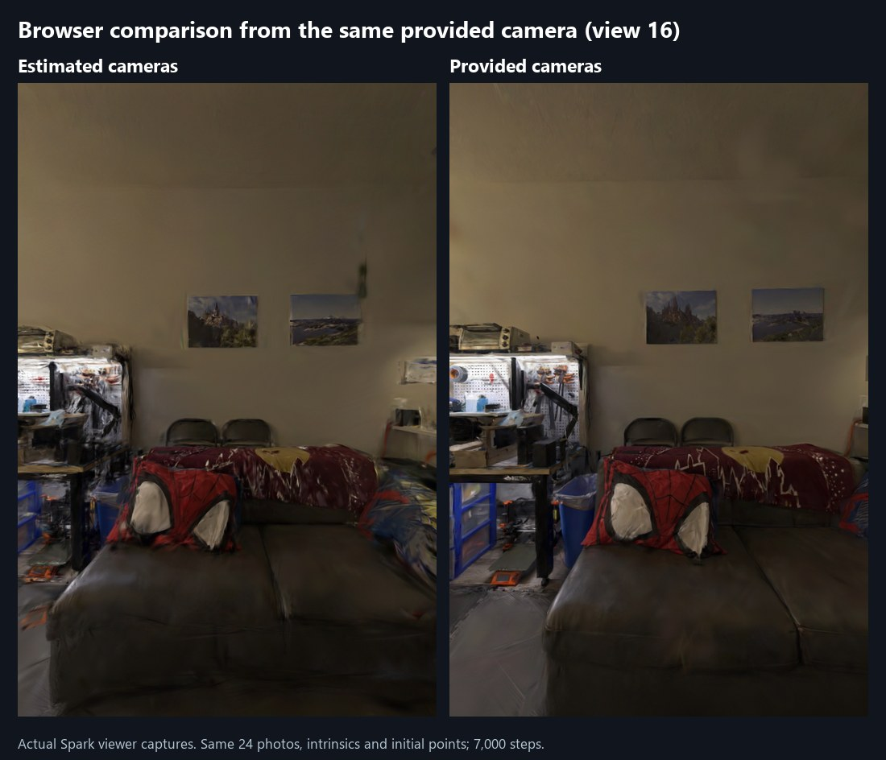
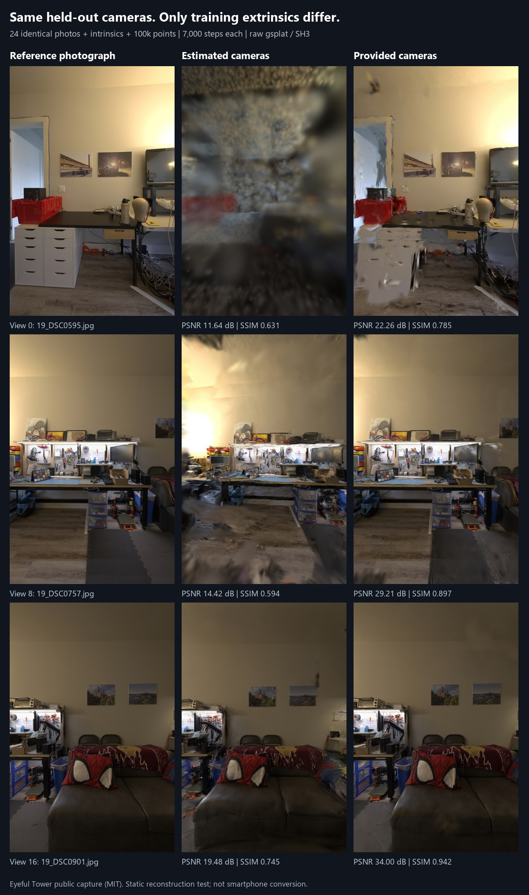

# Camera inputs and reconstruction quality

A completed L4 comparison using the same 24 photographs, intrinsics and initial
points improved mean PSNR from **15.18 to 28.49 dB** and SSIM from **0.657 to
0.874**, evaluated from the same three dataset-provided held-out cameras.
All three views improved. Browser captures also show clearer shelving and sofa
edges. This supports using provided cameras for this public scene; it does not
establish quality for a new phone capture or unobserved viewpoints.

The provided-camera result still has visible holes and smeared edges in view 0,
where the training views cover that direction sparsely. Browser rendering also
retains softness. Correcting the camera inputs does not remove these remaining
coverage and rendering limitations.



The current 156-photograph hero already uses provided cameras. This experiment
diagnoses the older 24-frame estimate and does not replace the hero or gallery.

The saved **7 October** 24-frame apartment-workshop model disagrees strongly with
the dataset-provided camera directions for the same captured spaces. This is a
diagnosis of that older model, not a measurement of the latest 8 October GPU run,
whose original camera model was not recovered.

The two consecutive sampled frames below show opposite walls. Their estimated
relative rotation is **6.111°**; the corresponding provided cameras rotate
**178.653°**. The rotation disagreement is **175.295°**, independent of the global
scale and alignment used for the positional comparison. The controlled training
comparison below measures the effect of changing the camera inputs as a whole;
it does not isolate this rotation error from positional errors.


Correspondences were selected from the 52 camera-19 photographs in the saved
calibrated interval using normalized central-image RGB correlation. All 24 best
matches are ordered consistently with the capture sequence, with correlations
between **0.9481 and 0.9920**. The opposite-wall frames were visually inspected.
Frame 9 has two nearly tied matches, `19_DSC0748.jpg` and `19_DSC0757.jpg`; their
provided camera centers differ by **0.000323 reference units** and rotations by
**0.0101°**. That ambiguity does not affect the frame-2-to-frame-3 result.

A single positive-scale, proper-rotation similarity fits the estimated centers
to the corresponding reference centers. The residual RMSE is **0.6730 reference
coordinate units**; this is not an independently measured metric distance.
The first two camera orientations disagree by approximately **179.6° / 179.8°**
after alignment. [Inputs, matching details, model hashes and measured angles](runs/quality/pose-disagreement-20261008.json).

## Controlled L4 comparison, 8 October 2026

The preparation script builds two fresh scenes from explicitly corresponding
camera models:

- **Estimated:** the previous VGGT extrinsics transformed into the reference
  coordinate frame by one global similarity.
- **Provided:** the dataset-provided extrinsics.

Both use the **same 24 undistorted JPEG photographs, reference intrinsics,
100,000 initial points and colors**. Camera/image IDs and image ordering are
matched. The only differing COLMAP model file is `images.bin`, which contains
the extrinsics. No pose outlier is silently repaired or removed.

This deliberately holds photographs, intrinsics and initialization fixed. It is
not a repeat of the old video recipe: that used decoded video frames, estimated
intrinsics and VGGT initialization. It does not test phone-video conversion or
SAM segmentation. Each completed training run used 7,000 steps and the same CLI
options; the worlds are static diagnostic scenes, not new live demo assets.

```bash
python scripts/prepare_pose_comparison.py --estimated-scene saved_vggt_scene --reference-scene saved_calibrated_scene --mapping corresponding-images.json --out pose-comparison-input
```

The mapping is a JSON array with `estimated_name` and `reference_name` fields.
Use an explicit mapping for the exact images, rather than assuming filenames or
capture ordinals are interchangeable. The prepared manifest records image/model
hashes and the similarity transform. Existing source scenes are retained.

On an already provisioned GPU, after the shared isolated-environment setup:

```bash
bash scripts/setup_gpu.sh
.gpu/envs/core/bin/python scripts/run_pose_comparison.py --input pose-comparison-input.zip --expected-sha256 ARCHIVE_SHA256 --out /content/pose-comparison-run --steps 7000
```

This runner does not allocate resources. It checks input CRC/SHA-256, shared
images/intrinsics/points and free GPU memory. It writes per-variant stage logs,
then publishes hashed final-checkpoint and world-ZIP chunks before moving to the
next variant. `comparison-job.json` records both attempt paths; start a local
[index watcher](colab-cli.md#automatic-backup-watcher) for each path early.

The prepared local input archive is **27,558,427 bytes**, SHA-256
`8721ecbbb0654b5085613da1bccc4e41adaeaabe16014c48d3e213fed180ceb4`.
Its integrity and shared-input properties were verified. Both training, world
export and backup paths completed on a dedicated NVIDIA L4 (23,034 MiB,
driver 580.82.07). An initial attempt failed before training because Colab's
inline Matplotlib backend was inherited by the isolated trainer environment.
The runner now sets `MPLBACKEND=Agg` and removes inherited `PYTHONPATH` before
launching its subprocesses. The failed attempt was retained and the comparison
retried with a fresh output directory and the existing installed environments.

| Measurement | Estimated cameras | Provided cameras |
|---|---:|---:|
| Training, seconds | 327.072 | 378.877 |
| World export, seconds | 5.453 | 6.416 |
| Final Gaussians | 1,322,057 | 1,695,831 |
| Movable objects | 0 | 0 |
| Static colliders | 3,187 | 4,061 |
| PSNR at common provided cameras, dB | 15.18 | 28.49 |
| SSIM at common provided cameras | 0.657 | 0.874 |

Both runs, exports and backup preparation took **757.265 s** together, excluding
environment installation, the failed attempt and local transfer/validation.
The task-owned L4 was terminated after **29 min 13.2 s**, measured from before
allocation. At the observed **1.54 units/hour**, estimated consumption is
**0.749972 units**, below the approved 40-minute / 1.03-unit limits. Individual
billing was not measured. An unrelated assignment was left running.

The final weights (312,008,373 / 400,219,061 bytes) and both world ZIPs were fully
recovered before termination. Whole-file SHA-256, ZIP CRC, CPU `weights_only`
loading, stored step 6,999 and all-finite Gaussian tensors passed. The exported
COLMAP camera/image/point files match the prepared inputs byte for byte.
Checkpoints contain Gaussian weights and step, without optimizer state.

## Same-camera evaluation

Every eighth sorted photograph was held out: indices **0, 8, 16**, leaving 21
training images. The raw final weights were rendered at all three **provided**
poses with their original pinhole intrinsics, SH3 and the classic gsplat
rasterizer. PSNR/SSIM compare those float renders against the decoded reference
JPEGs, before PNG quantization. These are quantitative gsplat measurements;
the Spark browser screenshots above are a separate qualitative check.



To reproduce the common-camera evaluation after this 7,000-step comparison,
using the installed gsplat environment:

```bash
PYTHONPATH="$PWD/src" .gpu/envs/gsplat/bin/python scripts/render_pose_comparison.py --comparison-job /content/pose-comparison-run/comparison-job.json --out /content/common-views
```

Each trainer's own-pose held-out PSNR was **20.57 / 28.49 dB**. The estimated
model's own-pose score is not the same as its **15.18 dB** score from the provided
poses. [Exact camera matrices, per-view metrics, stage timings, artifact hashes
and validation evidence](runs/quality/pose-comparison-20261008.json).

The default trainer derives scene extent from camera centers: **3.361874** for
estimated versus **3.127009** for provided cameras. That affects position
learning rate and densification thresholds. This is therefore a comparison of
camera inputs under identical CLI options, not an isolation of rotation,
translation or derived scene scale. It is one scene and one run per condition;
bitwise CUDA determinism and quality at new viewpoints were not established.

The photographs and derived comparison figures use the MIT-licensed Eyeful
Tower public capture; see [attribution and notice](data-attribution.md).

The new geometry/preparation tests verify a known synthetic similarity, unchanged
camera projections, recovery through COLMAP serialization, retention of a 180°
pose outlier, rejection of degenerate paths and identical training options.
Together with notebook-export tests, **17 related tests passed** during
preparation. After the environment and explicit-kernel-selection corrections,
the full local suite passed **89 tests, with 1 skipped**. The GPU experiment and
the six browser captures completed separately; they are not synthetic tests.
