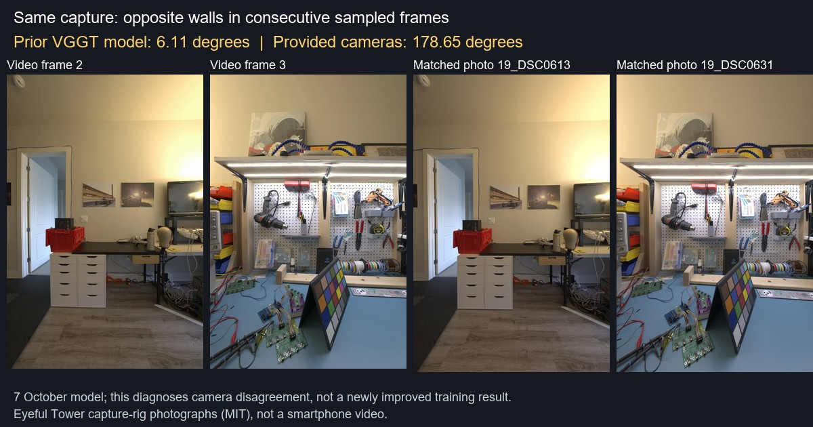

# Camera disagreement and a prepared controlled comparison

The saved **7 October** 24-frame apartment-workshop model disagrees strongly with
the dataset-provided camera directions for the same captured spaces. This is a
diagnosis of that older model, not a measurement of the latest 8 October GPU run,
whose original camera model was not recovered.

The two consecutive sampled frames below show opposite walls. Their estimated
relative rotation is **6.111°**; the corresponding provided cameras rotate
**178.653°**. The rotation disagreement is **175.295°**, independent of the global
scale and alignment used for the positional comparison. This can contribute to
superimposed surfaces and blur, but a corrected training result has not yet been
produced to establish its contribution.



Correspondences were selected from the 52 camera-19 photographs in the saved
calibrated interval using normalized central-image RGB correlation. All 24 best
matches are ordered consistently with the capture sequence, with correlations
between **0.9481 and 0.9920**. The opposite-wall frames were visually inspected.
Frame 9 has two nearly tied matches, `19_DSC0748.jpg` and `19_DSC0757.jpg`; their
provided camera centers differ by **0.000323 reference units** and rotations by
**0.0101°**. That ambiguity does not affect the frame-2-to-frame-3 result.

A single positive-scale, proper-rotation similarity fits the estimated centers
to the corresponding reference centers. The residual RMSE is **0.6730 reference
coordinate units**; this is not an independently measured metric distance.
The first two camera orientations disagree by approximately **179.6° / 179.8°**
after alignment. [Inputs, matching details, model hashes and measured angles](runs/quality/pose-disagreement-20261008.json).

## Prepared experiment — training not executed

The preparation script builds two fresh scenes from explicitly corresponding
camera models:

- **Estimated:** the previous VGGT extrinsics transformed into the reference
  coordinate frame by one global similarity.
- **Provided:** the dataset-provided extrinsics.

Both use the **same 24 undistorted JPEG photographs, reference intrinsics,
100,000 initial points and colors**. Camera/image IDs and image ordering are
matched. The only differing COLMAP model file is `images.bin`, which contains
the extrinsics. No pose outlier is silently repaired or removed.

This deliberately holds photographs, intrinsics and initialization fixed. It is
not a repeat of the old video recipe: that used decoded video frames, estimated
intrinsics and VGGT initialization. It does not test phone-video conversion or
SAM segmentation. Each proposed training run uses 7,000 steps and the same CLI
options; the worlds are static diagnostic scenes, not new live demo assets.

```bash
python scripts/prepare_pose_comparison.py --estimated-scene saved_vggt_scene --reference-scene saved_calibrated_scene --mapping corresponding-images.json --out pose-comparison-input
```

The mapping is a JSON array with `estimated_name` and `reference_name` fields.
Use an explicit mapping for the exact images, rather than assuming filenames or
capture ordinals are interchangeable. The prepared manifest records image/model
hashes and the similarity transform. Existing source scenes are retained.

On an already provisioned GPU, after the shared isolated-environment setup:

```bash
bash scripts/setup_gpu.sh
.gpu/envs/core/bin/python scripts/run_pose_comparison.py --input pose-comparison-input.zip --expected-sha256 ARCHIVE_SHA256 --out /content/pose-comparison-run --steps 7000
```

This runner does not allocate resources. It checks input CRC/SHA-256, shared
images/intrinsics/points and free GPU memory. It writes per-variant stage logs,
then publishes hashed final-checkpoint and world-ZIP chunks before moving to the
next variant. `comparison-job.json` records both attempt paths; start a local
[index watcher](colab-cli.md#automatic-backup-watcher) for each path early.

The prepared local input archive is **27,558,427 bytes**, SHA-256
`8721ecbbb0654b5085613da1bccc4e41adaeaabe16014c48d3e213fed180ceb4`.
Its integrity and shared-input properties were verified. The runner's training
and export path has **not** yet been executed on a GPU. The planned budget is a
separate L4 allocation capped at 40 minutes / 1.03 units, subject to user approval;
no allocation was made during preparation.

The new geometry/preparation tests verify a known synthetic similarity, unchanged
camera projections, recovery through COLMAP serialization, retention of a 180°
pose outlier, rejection of degenerate paths and identical training options.
Together with notebook-export tests, **17 related tests passed**.

After execution, compare both trained models from the same provided camera views.
Trainer held-out metrics evaluated with each variant's own poses should be labeled
separately. No image-quality gain or hero/gallery replacement is claimed yet.
