# Reconstruction quality

The room previews have visible blur and incomplete coverage. Gaussian pruning and a
longer training run do not reconstruct surfaces that were never observed.

## Postprocessing the automatic GPU export, 8 October 2026

The recovered 24-frame VGGT / 7,000-step export was compared locally from three
identical viewpoints. No new Colab runtime or training was used. The existing
conservative cleanup removed **369 / 2,012,863 background Gaussians (0.0183%)**;
blur and streaks remained visibly unchanged in the inspected views.

Two experimental background-only covariance caps were also rejected. Capping
each Gaussian standard deviation at **8 cm** changed **19,398** Gaussians without
a material overall improvement. A **4 cm** cap changed **339,146** and introduced
holes and blotches on the wall and bright right-hand surface. These distances
use the pipeline's assumed scale; this was not a change to the default filter.
All twelve captures retained identical physics snapshots, collision data, object
files, camera paths and rendering settings.

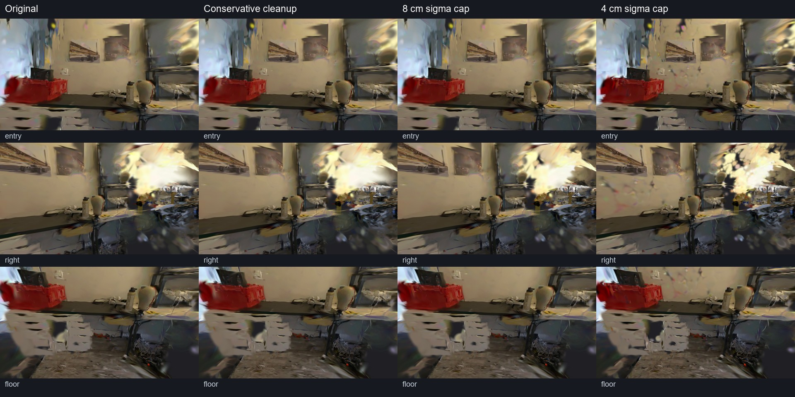

A separate diagnostic moved the camera approximately 14.7 cm upward and adjusted
pitch using the aligned reconstruction origin. Blur remained. The archive does
not contain the actual trained camera poses, so this diagnostic is an approximate
pose hypothesis, not an exact training-view comparison. These checks do not
establish whether pose estimation, view coverage or training is the main cause.
[Parameters, hashes and rejected candidates](runs/quality/gpu-cleanup-comparison-20261008.json).

That postprocessing experiment left the README hero and gallery unchanged. To support future diagnosis,
successful notebook ZIPs now preserve available COLMAP camera/image/point models
and pose diagnostics under `scene/`, without adding image or weight directories.
Synthetic tests recovered the camera centers byte for byte and verified that a
failed retry excludes the old world and camera model. The subsequent controlled
L4 comparison recovered both worlds' camera/image/point files byte for byte
against their prepared inputs.

The subsequent CPU investigation recovered an older model's camera data and
found a large direction disagreement: consecutive opposite-wall photographs
have **6.111°** estimated versus **178.653°** provided relative rotation. A
controlled camera-input comparison with identical images, intrinsics and initial
points then completed two 7,000-step L4 runs. At the same three provided held-out
cameras, mean PSNR improved from **15.18 to 28.49 dB** and SSIM from **0.657 to
0.874**; shelf and sofa outlines improved in the browser captures. The trainer's
derived scene extent also differs between conditions, so this does not isolate
rotation errors alone. It does not compare or replace the current 156-photo
hero, which already uses provided cameras. See [the diagnosis, comparison images
and measured results](pose-comparison.md).

## Reproducible corrections

Short training now scales the entire gsplat schedule with `--steps-scaler`, including
densification, opacity resets and the final settling period. Previously, reducing only
`max_steps` stopped training partway through the default 30,000-step strategy.

The CLI now schedules weight checkpoints and PLY exports at six milestones across
that scaled schedule. A 30,000-step run saves every 5,000 steps. This replaces the
final-only setting that lost the interrupted calibrated workbench at step 26,995.
Regression tests cover interruption during both 7,000- and 30,000-step command
schedules. The 8 October L4 trial actually saved all six checkpoints and PLYs at
5,000-step intervals. All six weight files were reloaded on CPU with finite tensors
([validation](runs/quality/workbench-checkpoint-validation.json)). The selected
5,000-step and final 30,000-step weights, photograph inputs, calibration and masks
were downloaded and checked locally before finishing the GPU work.
Upstream checkpoints preserve Gaussian weights and the saved step, but do not
contain the training optimizers: they are not exact training-resume snapshots.

`playworld world --clean-splats` conservatively rejects thick background volumes in the
aligned, assumed metric frame. Thin walls and low-opacity thin detail are retained.
The synthetic regression verifies that adding a diffuse background blob removes that
blob without changing collision geometry. Scale remains an estimate.

Blanket opacity pruning was rejected after browser comparison: it made dark holes in
the meeting-room lighting. Sparse-reference plane filtering also removed valid wall
coverage and was rejected. The optional `--quality` training preset requires
comparison rather than automatic adoption; camera optimization and volume regularizers
made some measured held-out views worse.

## Browser color and compression

`scripts/build_demo.py --format spz` preserves higher-order spherical harmonics through
SH3 using quantized SPZ v3. The older `.splat` export retains only DC color. This restores
view-dependent color, but cannot fix incorrect geometry. The encoder keeps the capture
axes because `world.align` already converts them to the viewer's world coordinates.
An extra coordinate flip would mirror or displace the reconstruction.

Optional encoder setup, in the isolated Linux/Colab core environment:

```bash
bash scripts/setup_spz.sh
```

## Calibrated public showcase

The public-data preparation script deliberately uses the dataset's COLMAP camera
calibration **and sparse point initialization**, plus its undistorted JPEG photographs.
It does not invoke VGGT or estimate camera poses from a video. This distinguishes a
visual showcase of the playable-world builder from a test of automatic video conversion.

```bash
pip install -e '.[showcase]'
python scripts/prepare_calibrated_public.py office1b --out scenes/calibrated-meeting --frames 64 --camera 19,16,22
```

With the isolated environments from `scripts/setup_gpu.sh`, the corresponding stages
are explicit. Adjust interpreter paths when using another GPU root:

```bash
.gpu/envs/core/bin/playworld train scenes/calibrated-meeting --gsplat-dir .gpu/repos/gsplat --python .gpu/envs/gsplat/bin/python --steps 30000
.gpu/envs/core/bin/playworld segment scenes/calibrated-meeting/segment-scene --python .gpu/envs/sam3/bin/python --prompts chair --seed-frame 0
.gpu/envs/core/bin/playworld world scenes/calibrated-meeting/segment-scene --splats scenes/calibrated-meeting/gs/ply/point_cloud_29999.ply --out calibrated_world --bounds-margin 6 --clean-splats
```

Use the PLY filename actually exported by the pinned trainer. This recipe needs a
GPU with sufficient free memory; sharing, queueing and setup are outside stage timings.

The committed meeting room retains manually reviewed instance 1 from the seed-frame-0
masks. A later seed-frame-5 trial yielded chair fragments and a floor false positive;
those masks were rejected. Running the commands above produces unreviewed masks:
inspect them and keep the desired instance before packaging a showcase.

The adopted 192-photo / 30,000-step run reached held-out PSNR 26.9179, SSIM 0.90094
and LPIPS 0.24692. The earlier 64-photo / 15,000-step default trial reached 23.1405,
0.87319 and 0.30527. These use different training and validation views, so this is
not a controlled improvement attributed solely to one setting. Rendered review found
clearer walls, tabletop and floor from the chosen capture viewpoints. Close mesh-chair
backs still streak; moving the chair exposes incomplete surfaces. The room is not
artifact-free and this does not establish arbitrary-view photorealism.

[Exact calibrated run and manual selection](runs/quality/calibrated-multi-192.json).

The preparation manifest records each photograph and reconstruction file's URL, byte
count and SHA-256. Intrinsics are resized to the exact downloaded image dimensions;
camera rotations, translations and point coordinates retain their shared source frame.
SAM 3 can run on the generated sixteen-view `segment-scene`, in that same frame,
while gsplat trains on all selected photographs.

For a selected part of a longer capture, `--start-index` and `--stop-index` select
an ordinal interval independently in each camera's sorted photographs. The stop
index is exclusive; `--frames` is a maximum per camera. This apartment interval
downloads 52 photographs per camera, 156 total, rather than training on unrelated
parts of the full apartment sequence:

```bash
python scripts/prepare_calibrated_public.py apartment --out scenes/calibrated-workbench --frames 64 --camera 19,16,22 --start-index 60 --stop-index 112
```

The manifest retains the interval and exact photographs. Ordinals refer to sorted
capture photographs, not seconds in an arbitrary input video.

`scripts/run_calibrated.py` runs preparation, training, segmentation and assembly
with the same isolated GPU environments, and writes stage logs and a timing report.
It checks SAM 3 access before preparing data and requires fresh output directories.
For the selected workbench interval, the prepared command is:

```bash
python scripts/run_calibrated.py apartment --scene scenes/calibrated-workbench-run --out calibrated_workbench_world --camera 19,16,22 --frames 64 --start-index 60 --stop-index 112 --steps 30000 --seed-frame 5
```

Install `.[showcase]` in the core environment for calibrated-image preparation.
The underlying preparation, training, segmentation and assembly commands completed
on an existing L4 on 8 October. The complete portable wrapper has not been invoked
end to end; the measured run used an equivalent orchestration script. Review masks
before publishing outputs. An initial SPZ export used the wrong Python environment;
repeating CPU assembly/export with `.gpu/envs/core/bin/python` resolved it without
another training run.

The current README workbench keeps **`point_cloud_4999.ply` from that 30,000-step
trial**, rather than the final PLY. This is not equivalent to a separately scaled
5,000-step run. The same camera path was rendered with reviewed label-1 box masks
at 5,000, 10,000 and 30,000 steps. The early export looked smoother; the final export
had finer speckling on the workbench and floor. The final held-out PSNR of 30.6495
is a metric for the rejected 30,000-step weights, not for the adopted hero, and the
held-out views differ from the earlier VGGT experiment.

Before the local box refinement, the selected export had **1,110,159 Gaussians,
one movable box, 2,834 static colliders and one support patch**, with 20,089,789
bytes of SPZ. Bounds cleanup removed 27,647 Gaussians, diffuse cleanup 3,823,
and the initial object-spill cleanup five.
Only the reviewed box moves; other SAM detections remain static. Vertex colors
sampled from the observed support surface reduce the dark hole left after the box
moves. This remains a flat approximation. The current workbench uses the bottom-cap
refinement described below. Floor blur, mask-edge fragments and incomplete views remain.

The first proposed player position overlapped low collision boxes and could not
walk. The committed profile moves its XZ start by approximately 0.72 m to a clear
location; camera keyframes still follow the capture viewpoints. Real keyboard and
touch-emulated walking, a falling/inverting box and repeated fixed-step physics were
checked. The cinematic camera is independent of the capsule controller. The
[measured trial and selection](runs/quality/calibrated-workbench-156-selected-5000.json)
and [hero checks](hero-validation.json) separate reconstruction from browser results.

Only reviewed MIT-licensed Eyeful Tower scenes are accepted. Keep the dataset's
[MIT notice](EYEFULTOWER-LICENSE.txt) with redistributed outputs. Dataset attribution
does not change model-weight licenses or demonstrate smartphone capture quality.

## Reviewed workbench box refinement (CPU)

The selected 5k weights and downloaded masks/calibration were reused locally. No
new Colab session or GPU training was used. The original background SPZ is retained
byte for byte. Collision hull, mass, centroid, support, all 2,834 static colliders
and the camera/action timeline are unchanged.

The adopted object keeps 8,551 of its original 9,258 splats. Cleanup uses the full
room for visibility and removes points with at least two outside-mask votes and
an 80% majority, scales above 8 cm or centers below the support tolerance. Unseen
points are retained rather than treating missing object votes as background.
Discarded ambiguous edges do not become static copies of the box. The world now
contains **1,109,452 Gaussians and 20,079,956 SPZ bytes**.

The lower photographed sides fit an inset oriented rectangle. Only a horizontal
bottom is added, with cardboard color sampled from the captured lower surfaces;
it replaces the large sloping convex interior that appeared when the box inverted.
This manually reviewed open-box correction is not applied automatically to chairs,
mugs or every segmented object, and the bottom is not recovered photographic texture.

A strict segmentation/physics rebuild stopped the existing push from dropping
the box and was rejected. Object-only visibility removed too many real sides
(only 4,883 splats survived) and was also rejected. Refitting the support patch
to the rectangular bottom sampled bright neighboring desk colors and looked
like a pale panel, so the existing observed-color support patch was retained.
The hidden tabletop and keyboard remain approximate, and floor blur is unresolved.

[Refinement and rejected candidates](runs/quality/workbench-box-polish.json) ·
[Before/after interaction video](demos/workbench-box-comparison.mp4).

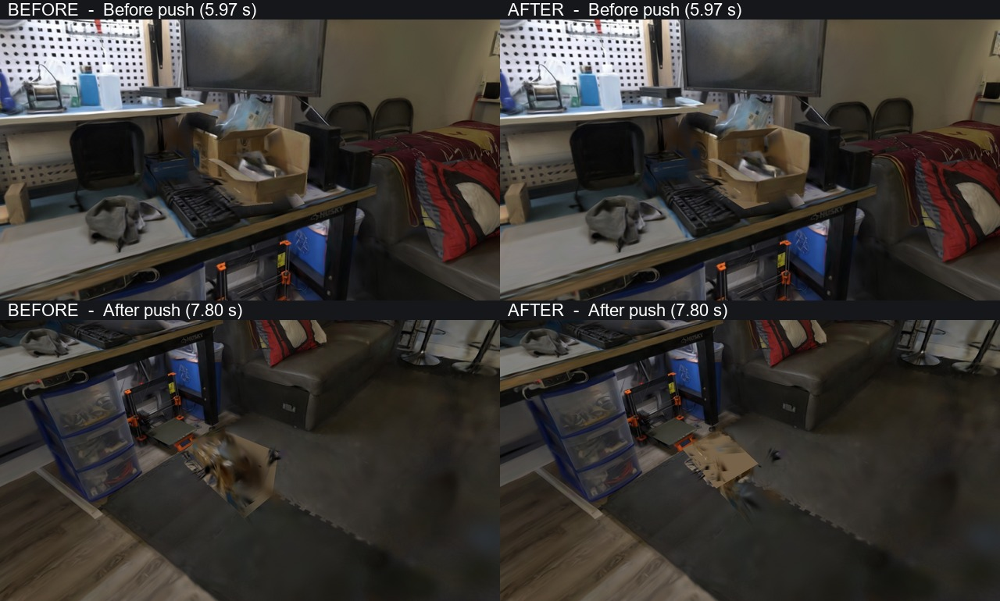

Reproduce with an assembled PLY world and the reviewed masks in the same source
coordinate frame; choose a fresh output directory:

```bash
python scripts/polish_box.py --world reviewed_world --sparse scene/segment-scene/sparse --masks scene/masks-reviewed --subject 1 --out polished_world
```

This is a manual showcase operation for an inspected open box. It is separate
from the automatic video pipeline. The synthetic regression preserves original
collision data and source files, and checks occlusion, support tolerance, a rotated
inset bottom and insufficient/degenerate lower geometry.

## Calibrated kitchen and chair refinement, 9 October 2026

The kitchen/cafe now uses **144 provided photographs and camera calibration**
from three cameras, replacing its older video/VGGT reconstruction. A 7,000-step
L4 run completed training, segmentation and assembly; the final checkpoint,
raw PLY, camera models and masks were recovered before shutdown. The reviewed
foreground chair has a complete silhouette across its masks. Other detections
included thin fragments, so they remain static.

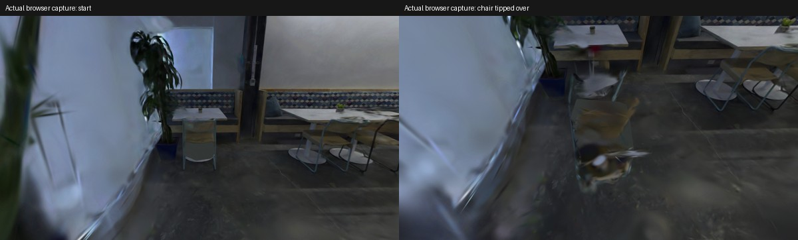

Removing the entire visual interior opened the gaps between the chair's legs,
but made its unobserved reverse side too transparent when it fell. Filling only
the convex upper interior above assumed height **0.38 m** retains those leg gaps
while covering the unseen seat/back interior approximately. Hull-edge intersections
preserve the upper outline; the existing physics body and floor patch remain
unchanged. This is a colored approximation, not recovered photographic texture.
Synthetic-room regressions check the cut plane, upper outline, degeneracy,
source preservation and unchanged collisions and object splats.

The initial forward ray push was blocked by the table. A side push moved and
yawed the chair but failed to tip it at the final event time. A gentler ray from
behind the chair at 3 s brings it out from the table: **0.817 m movement and
90.03° maximum tilt** in the complete browser capture. Gallery verification now
supports a minimum tilt requirement in addition to movement and exact replay.
The camera follows the falling chair; its path is independent of the character.

Floor and vegetation blur remain substantial, especially in close views and
outside the supplied capture path. Input photographs, camera poses and training
schedule differ from the old cafe; the new **26.874 dB** held-out PSNR is not a
controlled improvement measurement. The scene remains an approximate showcase.
[Parameters, rejected trials, hashes and measured stages](runs/quality/cafe-calibrated-20261009.json)
and [benchmark](benchmarks.md#calibrated-kitchen-9-october-2026).

To reproduce the reviewed visual cut on a world with an existing interior color,
choose an explicit object ID, cut height and fresh destination outside the source:

```bash
python scripts/polish_visual_fill.py --world reviewed_world --out polished_world --object 1 --min-y 0.38
```

The height is manually reviewed in the assumed world scale; this correction is
not automatically applied to every detected chair.


## Five-room review and next prepared input, 9 October 2026

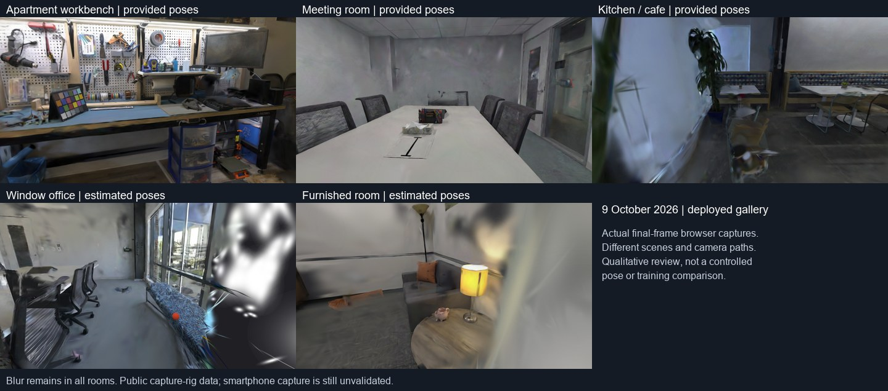

The window office is the next reconstruction priority: the inspected deployed
view contains a large bright floating volume at right and streaked chair/table
edges. The furnished room also has wall smears and translucent furniture, and
is the second priority. Workbench, meeting room and kitchen still have visible
artifacts. This is a qualitative review of different rooms and camera paths,
not a controlled comparison of calibration or training quality.

The next window-office input is **prepared, not trained**: 144 undistorted public
`office_view2` photographs from cameras 19, 16 and 22, provided COLMAP calibration
and 100,000 sparse initialization points. Sixteen primary-camera photographs
are retained for segmentation. ZIP SHA-256, CRC, photograph hashes and identical
training/segmentation photograph copies passed the prepared-run extractor.
The ZIP is 78,907,354 bytes and remains in the local cache.

Seed photograph 11 (`19_DSC0433.jpg`) shows two full office chairs and the window
bench. Mask quality and instance selection have not yet been tested. The proposed
7,000-step run will use `chair,cushion`; adopting its output requires visual and
physics review. No runtime was allocated for this preparation. Colab reported
zero assignments and 0.00 units/hour after preparation.

[Review, source hashes and prepared command](runs/quality/gallery-review-20261009.json)
· [Photograph/calibration manifest](runs/quality/lounge-prepared-source-20261009.json)
· [Sixteen segmentation photographs](runs/quality/lounge-prepared-contact-20261009.jpg).
The current README GIFs and live scenes remain unchanged by this review.


## Window-office calibrated trial: not adopted, 9 October 2026

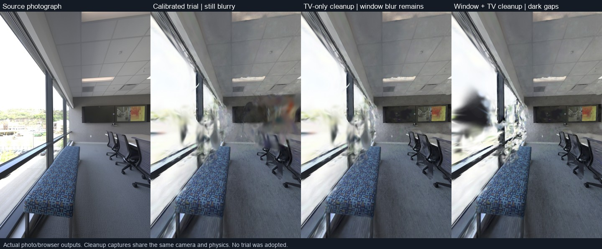

The prepared 144-photograph window office completed 7,000 training steps, SAM 3
and world assembly on a dedicated L4. Checkpoint, raw PLY, sixteen masks and both
camera models were recovered and verified before shutdown. The run was **not
adopted**: large TV/window floaters remained in a capture matching the supplied
camera center, optical axis, aspect and field of view. The viewer uses fitted
world-up rather than the source camera's individual roll. The causes of the
remaining blur have not been established; the input and training schedule differ
from the current VGGT office, so this is not a controlled pose-only comparison.

SAM instance IDs also switched between neighboring chairs. The automatic world
contained three fragments, not three complete movable chairs. A local diagnostic
manually associated the same middle chair as label 2 in `19_DSC0397.jpg` and
label 1 in `19_DSC0433.jpg`, and assembled only those two reviewed views. It
recovered a 0.980 m tall body, but its horizontal extents were 0.185 × 0.824 m.
A ray that hit that body produced only 0.054 m displacement and 3.57° sampled
maximum tilt; other trial rays were blocked or missed. This did not pass the
visible-movement or tipping criteria and was not published as a playable result.

CPU-only sparse-reference pruning removed 39,250 background Gaussians in the TV
region and reduced the central floating volume. Expanding the operation to the
window/TV view removed 56,645 or 106,077 Gaussians and exposed dark window gaps.
All variants retained the same collision data, object splats and camera/physics
settings. TV-only cleanup still left substantial window blur and did not solve
the interaction failure. These experimental filters were not added to the default
pipeline or current live scene.

The existing window-office GIF and live assets remain byte-identical to their
saved baseline. The recovered masks, calibration and raw PLY support a further
CPU investigation of identity associations, visibility votes, inlier pruning and
static chair remnants. No further GPU runtime was started.

[Parameters, artifact hashes, mask counts, browser captures and rejected pushes](runs/quality/lounge-calibrated-20261009.json)
· [Measured run](benchmarks.md#calibrated-window-office-trial-9-october-2026).


## Window-office chair extraction repair, 9 October 2026

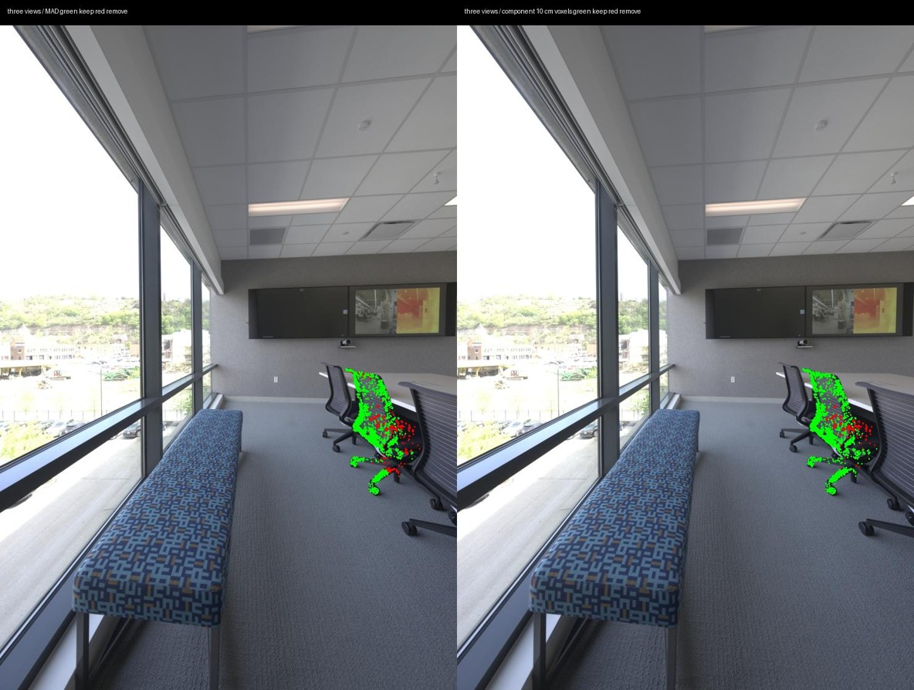

CPU diagnosis found two separate problems. SAM IDs changed for the same middle
chair: 2 in `19_DSC0397.jpg`, 1 in `19_DSC0433.jpg`, and 9 in
`19_DSC0595.jpg`. These three masks were visually reviewed and manually associated;
automatic tracking remains unresolved. Separately, the per-axis median absolute
deviation (MAD) filter rejected observed seat/leg points because the backrest
contained most of the reconstructed points. Repeated MAD filtering eroded the
already-cleaned object further.

The optional `--object-filter connected` keeps the largest connected component
of occupied 10 cm voxels, weighted by original point count. It excludes broad or
invalid splats before finding connectivity. In a controlled geometry comparison
using identical three-view masks, cameras and alignment, the hull extents changed
from **0.231 × 1.214 × 0.926 m** with MAD to **0.494 × 1.217 × 1.036 m** with
connected voxels. These are assumed-scale dimensions, not physical measurements.
The standard filter remains MAD. Connected voxels can join nearby background
spill or omit valid separated parts; they do not repair segmentation identities
or reconstruct unseen surfaces.

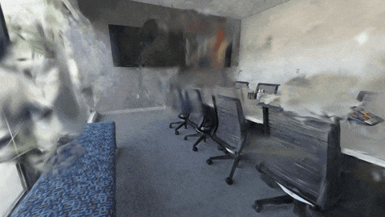

The reviewed scene's ray push hit the backrest and moved the chair **1.202 m**,
with **140.92°** maximum tilt across all 120 recorded frames. Initial settling
before the push was **0.041 m**. Two independent replays matched exactly at eight
sampled states, with no page errors. Push direction and hit height also changed
from the earlier failed trial; successful tipping cannot be attributed to the
filter alone. Several other directions still hit static geometry or miss.
The convex physics body remains an approximation: its volume-based mass estimate
includes empty space between chair parts and is not a measured chair mass.

The 8 s diagnostic is actual fixed-step browser output: 960×540 MP4 and
480×270 GIF, 1,187,731 bytes. The chair's convex visual fill was disabled to
preserve gaps between its legs. The approximate floor support patch remains.
**TV/window blur is still substantial, so this reconstruction was not adopted
for the README hero or live gallery.** No Colab runtime, training or SAM inference
was started for this repair. Existing window-office media and live assets retain
their baseline hashes.

The review can be reproduced from the recovered trial artifacts:

```bash
python scripts/remap_instances.py --scene recovered/scene/segment-scene --review shots/lounge-chair-review.json --out reviewed-scene
playworld world reviewed-scene --splats recovered/scene/gs/ply/point_cloud_6999.ply --out reviewed-world --object-filter connected --clean-splats --bounds-margin 6
```

The supplied review file applies only to this saved SAM run; new masks require
their own visual associations. The tool writes a fresh assembly-only camera/mask
scene and hashes its source inputs, preserving original masks and sparse points.
It does not rerun training or automatically associate instances. Synthetic tests
cover dense backrests with sparse seats/feet, detached spill, broad bridging
splats, repeated cleanup, support surfaces and a complete synthetic room.
The full suite passed **109 tests**, with one existing skip.

[Review, controlled geometry, hashes and replay states](runs/quality/lounge-chair-repair-20261009.json)
· [Diagnostic MP4](runs/quality/lounge-chair-repair-20261009.mp4)
· [Encoding receipt](runs/quality/lounge-chair-repair-20261009-provenance.json)
· [Recorded shot](../shots/lounge-chair-diagnostic.json).

## Local window-office refinement, 9 October 2026

Input remains the MIT-licensed Eyeful Tower `office_view2` photograph sequence,
not smartphone video; [attribution](data-attribution.md) and the
[dataset license](EYEFULTOWER-LICENSE.txt) apply to these derived comparisons.

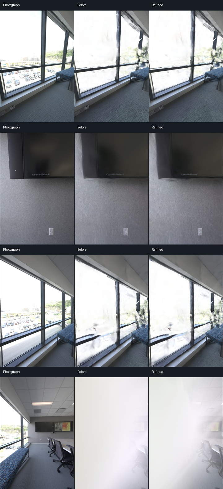

The 144-image input was audited before further training. All 18 saved trainer
targets matched the decoded source JPEGs pixel for pixel. Photographs matched
their own camera's dimensions: 740×1112, 740×1118 or 740×1117, with separate PINHOLE
intrinsics. This rules out the checked target/resolution mismatch, but does not
prove that every provided camera pose is accurate.

The recovered step-6,999 checkpoint was warm-started locally on a **GTX 1660 Ti
(6GB)** with fresh Adam optimizers. Cameras and the count of **1,108,601 Gaussians**
stayed fixed. The source rendered at **20.9642 dB PSNR** on the same 18 sorted
heldout images, reproducing the original L4 value of 20.9621 to about 0.002 dB.
Evaluation uses float RGB, not the JPEG comparison images.

RGB-only refinement barely helped. An experimental color-gated sparse-SfM depth
penalty and adjusted position learning rate raised mean heldout PSNR to
**21.4842 dB**, with local SSIM **0.800788 → 0.805519**. The selected 2,000-step
run took **361.575 s**, excluding setup, checkpoint/image loading and later world
assembly. Peak allocated CUDA memory was **1,531.119 MiB**, not total driver-visible
memory or evidence that SAM/VGGT fits this GPU. Depth anchors use training images
only, but hyperparameters and best step were selected on the existing validation
split: this is not an independent final test. Some photographs regressed.
Sparse visibility can miss occluders; the anchors are not ground-truth depth maps.

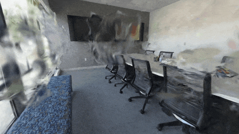

Reassembly used the previous three reviewed chair masks and connected filtering.
It retained **1,106,182 Gaussians**, **1 chair**, **4,481 static colliders** and
**1 support patch**. The same diagnostic camera path and ray push moved the chair
**1.008 m**, with **0.006 m** initial settling. Two independent replays matched
exactly at eight sampled states with no page errors. Distances use the assumed
camera-height scale; the convex chair body remains approximate. Maximum tilt
across all 120 recorded frames was **155.26°**.

A further cleanup probe removed **17,936 Gaussians** whose centers lay within
0.2 capture units (about **0.264 m** at the assumed scale) of any of the 126
training cameras. Mean validation PSNR rose to **22.0779 dB**, SSIM to **0.813094**,
but the bright occlusion in `19_DSC0406.jpg` remained. The radius is a heuristic,
not measured free space, and can erase real nearby surfaces. This additional
pruning was not browser/physics-validated, adopted or added to the pipeline.
Another probe removed just three large Gaussians whose 3-sigma ellipsoids
contained a training-camera center; that condition did not explain the main blur.

**The higher average metric did not fix the room.** TV/window floating volumes
remain prominent in the browser, wall texture is streaky, and some heldout views
are covered by bright floating surfaces. This is a diagnostic, not a README/gallery
replacement. Existing window-office media/assets retain their baseline hashes.
No Colab allocation, SAM inference or paid runtime was started for this refinement.

The [local setup and refinement recipe](gpu.md#local-checkpoint-refinement-tested-on-gtx-1660-ti)
is reproducible from the saved training scene and checkpoint. It writes fresh
outputs and preserves inputs; exports remain weights-only, not exact-resume
snapshots. The experimental depth prior is disabled by default.

[Measurements and artifact hashes](runs/quality/lounge-refinement-20261009.json)
· [Diagnostic MP4](runs/quality/lounge-refinement-20261009.mp4)
· [Encoding receipt](runs/quality/lounge-refinement-20261009-provenance.json)
· [Same-camera browser comparison](runs/quality/lounge-refinement-browser-20261009.jpg).

## Window-office interior floater cleanup, 9 October 2026

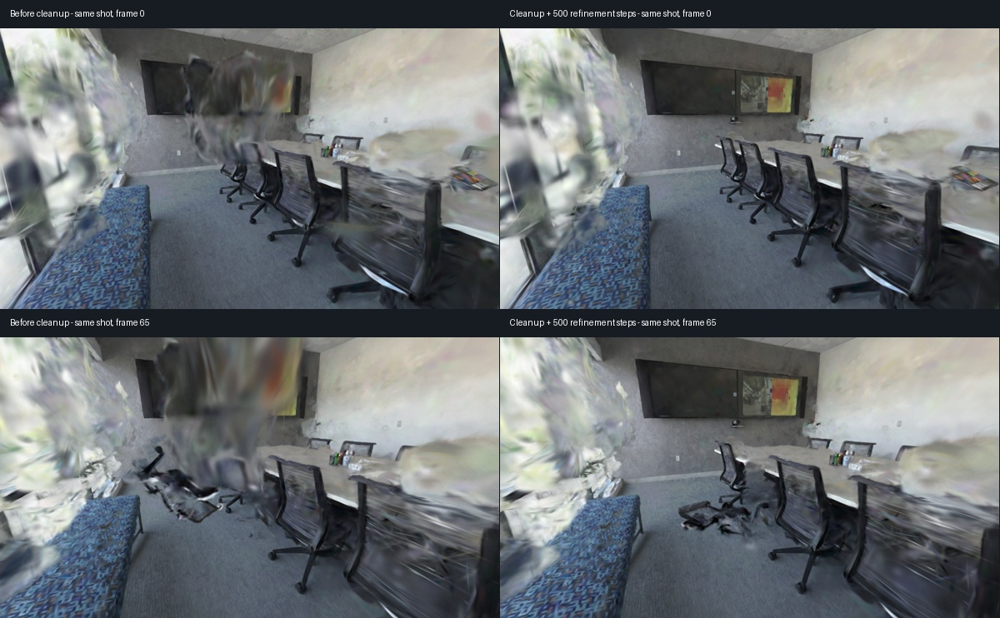

The central floating volume is now substantially reduced in the recorded view.
GPU diagnostics reproduced the browser artifact in the raw checkpoint, before
SPZ packaging. It was therefore not explained by SPZ conversion alone. In the
problematic `19_DSC0406.jpg` view, some off-screen Gaussian centers had camera
depths around **0.011 capture units** and projected radii of thousands of pixels.
For example, Gaussian 327652 had radii **3,848 × 5,019 pixels**, with its center
about **0.407 capture units** from the nearest sparse reference point. Increasing
gsplat's near clip from 0.01 to 0.1 reduced extreme projection artifacts but left
substantial window blur. No default clip setting was changed.

In the diagnostic browser camera's TV-region projection, the 100 Gaussians with
largest positive opacity gradients of squared rendered brightness were all
rejected by the new support filter. That brightness probe is not ground-truth
image error or proof that every selected Gaussian is invalid; the actual
before/after rendering demonstrates the visible effect. Sparse distances for
its leading contributors were approximately **0.4–0.6 capture units**. These
observations identify a contributing floating cluster, not the cause of every
remaining artifact or proof that all camera poses are correct.

The optional CPU `scripts/clean_interior.py` removes unsupported centers only
inside the horizontal convex hull of capture-camera centers, inset **0.05 m**,
within the **0.25–2.75 m** height band. The tested distance limit was **0.30 m**
from the sparse point cloud. Distances depend on the existing world's assumed
scale. The trial used the 126 training-camera centers, excluding the 18 heldout
centers, and removed **34,071 of 1,108,601 Gaussians**. It preserves points outside
the footprint and band; this avoids blanket exterior/window pruning. The hull
is not measured free space: unsupported real interior surfaces can also be lost.
This filter is opt-in and has not been added to `playworld all` defaults.

| Same 18-image validation split | Mean PSNR (dB) | Local SSIM |
| --- | ---: | ---: |
| Previous refined checkpoint | 21.4842 | 0.805519 |
| Near clip 0.1 only, unchanged weights | 22.1068 | 0.818701 |
| Interior support cleanup, no extra learning | 22.9816 | 0.824828 |
| Cleanup then 500 fresh-Adam steps | 23.1516 | 0.830077 |

The local baseline before either refinement remains **20.9642 dB**. Hyperparameters
and the final checkpoint were selected using this validation split and visual
review; these are not independent final-test results. Some individual views
regressed. `19_DSC0406.jpg` improved from **6.981 dB** in the previous refined
checkpoint to **21.304 dB** after cleanup alone.

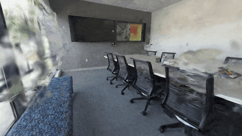

The final reconstructed diagnostic has **1,072,039 Gaussians**, **1 reviewed
movable chair**, **4,394 static colliders** and **1 support patch**. The same shot
and ray push moved the chair **0.672 m**, with **0.006 m** initial settling and
**174.05°** maximum tilt over 120 recorded frames. Two independent replays matched
exactly at eight sampled states, with no page errors. The approximate convex
chair body and assumed scale remain limitations. This uses the earlier manual
three-mask association, not newly validated automatic SAM tracking.

**Window haze and chair/wall streaks remain.** This is a stronger diagnostic,
but was not adopted as the README hero or live-gallery replacement. Current
published window-office media/assets retain their baseline hashes. No Colab or
paid resource was allocated; GPU evaluation/refinement used the local GTX 1660 Ti.
Input remains MIT-licensed Eyeful Tower `office_view2` photographs, not phone video;
[attribution](data-attribution.md) and [license](EYEFULTOWER-LICENSE.txt) apply.

The [CPU cleanup and optional warm-start recipe](gpu.md#optional-interior-support-cleanup)
writes fresh outputs and hashes source inputs. Synthetic tests preserve the
complete observed room, rigid-body parts and exterior geometry while removing an
injected interior floater. The full native suite passed **118 tests**, with two
skips; the combined refinement/cleanup tests passed **14 tests** in the Torch
environment. A post-refinement support check found 33 newly unsupported centers:
the warm-start option performs one-time filtering, not a persistent constraint.

[Audit, metrics, hashes and replay states](runs/quality/lounge-interior-cleanup-20261009.json)
· [Heldout photograph comparisons](runs/quality/lounge-interior-cleanup-heldout-20261009.jpg)
· [Diagnostic MP4](runs/quality/lounge-interior-cleanup-20261009.mp4)
· [Encoding receipt](runs/quality/lounge-interior-cleanup-20261009-provenance.json).

## Window-office floor footprint and photo window, 9 October 2026

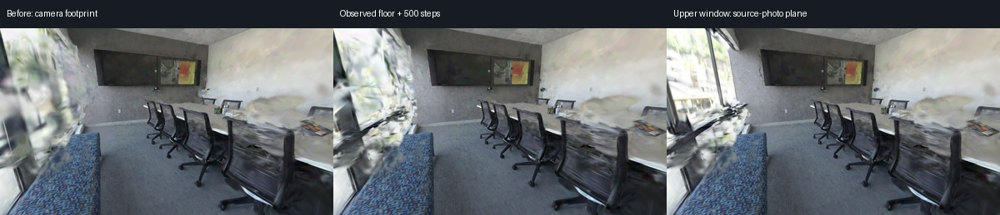

The upper window's large white floating volume is reduced in the last view.
**The window in that view uses a disclosed source-photo plane, not reconstructed
exterior geometry.** Lower-window haze, table/wall streaks and photographic seams
remain. This is a diagnostic; the current README hero and five gallery worlds
have not been replaced. The calibrated chair trial is a different model from
the live window-office demo with its movable cushion.

The previous filter stopped at the capture-camera hull. Many window-region
contributors lay just outside it, but inside the observed floor footprint.
The opt-in `--footprint floor` mode takes sparse points within **0.06 m** of
aligned y=0, connects horizontal **0.20 m** voxels with eight-neighbor adjacency,
and selects the component with the largest original point count. In this room
that component contained **69,389 points**. Its convex hull uses the same
**0.05 m** inset, **0.25–2.75 m** height band and **0.30 m** reference-distance
threshold. It removed another **51,434 of 1,074,530 Gaussians**. All distances
depend on the existing assumed scale. Unlike camera mode, floor mode does not
use camera centers; its sparse reference model includes the provided dataset
points. Neither footprint is measured free space. Real unsupported surfaces
can be lost, and disconnected exterior floor patches are excluded only by the
component heuristic.

The squared-brightness probe in the scripted camera's leftmost 260 pixels found
that **68 of its 100 leading positive opacity-gradient candidates** were removed.
This probe has no ground-truth target and does not prove every candidate invalid.
The CPU PLY mask exactly matched the checkpoint prototype; evaluation through
the new CLI reproduced its Gaussian count and pre-training metric.

| Same 18-image validation split, raw Gaussian render | Mean PSNR (dB) | Local SSIM |
| --- | ---: | ---: |
| Previous camera-footprint cleanup + refinement | 23.1516 | 0.830077 |
| Observed-floor cleanup, no extra learning | 23.4102 | 0.828603 |
| Floor cleanup then 500 fresh-Adam steps | 23.9322 | 0.833482 |

These metrics are **before the photo plane**. The initial floor-only result had
lower SSIM despite higher PSNR, and individual views can regress. Parameters
and the final checkpoint were selected on the existing validation split, not an
independent test set. Reloading the final checkpoint reproduced its metrics.
The run kept cameras and Gaussian count fixed, without densification, and used
the existing three-mask manual chair association rather than fresh SAM inference.

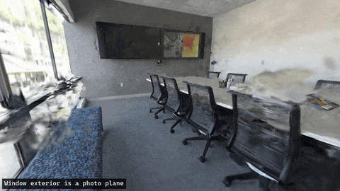

`scripts/bake_window_backdrop.py` is a separate, optional presentation fallback.
An approximate vertical window plane was fitted to **926 sparse points**, with
median inlier distance **0.0114 m**; its bounds and four source photographs were
reviewed manually. The tested region spans **y=1.10–2.75 m**. The script resamples
the calibrated, undistorted photographs onto a **2048×512** texture, replacing
**79,713 background Gaussians** in the configured window strip. The strip uses
world-x offsets relative to the fitted plane, not normal distance. Window frames
in that region are also represented by the photograph. No image generation or
inpainting occurs. Exterior depth and true parallax are absent; seams can become
visible from other viewpoints. This configuration is specific to this capture.

Per-pixel photo selection produced tears across outdoor buildings. Extending
the plane down to y=0.18 m copied foreground chairs into the window texture;
that version was rejected. Restricting full-pane source photos to nearby
cameras covered only 50.6% of the texture and was also rejected. The narrower
upper-window fallback avoids those photographed chairs but leaves lower haze.

Before the photo fallback, assembly retained **1,020,607 Gaussians**. The displayed
fallback has **940,894 Gaussians**, **1 reviewed movable chair**, **4,047 static
colliders**, **1 support patch** and **1 photo plane**. The chair moved **0.635 m**,
settled initially by **0.006 m** and reached **130.87°** maximum tilt over the
120-frame replay. Two replays matched at eight sampled states with no page errors.
Adding the photo plane preserved **all 120 recorded physics states** relative
to the floor-cleaned world. Normal page loading also verified the visible
photo-plane disclosure; gallery featured actions were not revalidated here.

The GIF/MP4 burn in “Window exterior is a photo plane”, and recording/encoding
receipts identify the fallback. No Colab, paid runtime or SAM inference was
started. Computation used the local GTX 1660 Ti. Input remains MIT-licensed
Eyeful Tower `office_view2` capture-rig photographs, not smartphone footage;
[attribution](data-attribution.md) and [license](EYEFULTOWER-LICENSE.txt) apply.

[CPU/GPU recipes and reviewed-photo workflow](gpu.md#optional-observed-floor-footprint-and-photo-window)
· [Metrics, audits, hashes and replay states](runs/quality/lounge-window-cleanup-20261009.json)
· [Heldout comparisons without the photo plane](runs/quality/lounge-window-cleanup-heldout-20261009.jpg)
· [Diagnostic MP4](runs/quality/lounge-window-cleanup-20261009.mp4)
· [Encoding receipt](runs/quality/lounge-window-cleanup-20261009-provenance.json).
